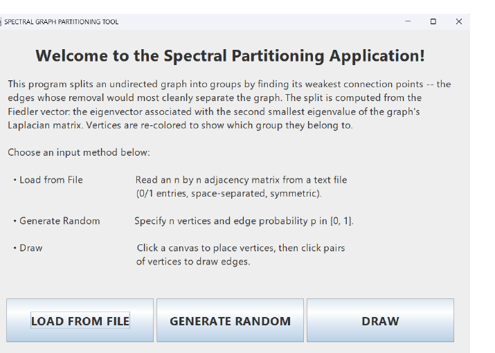
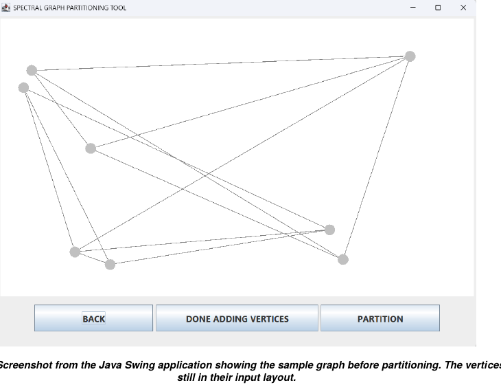
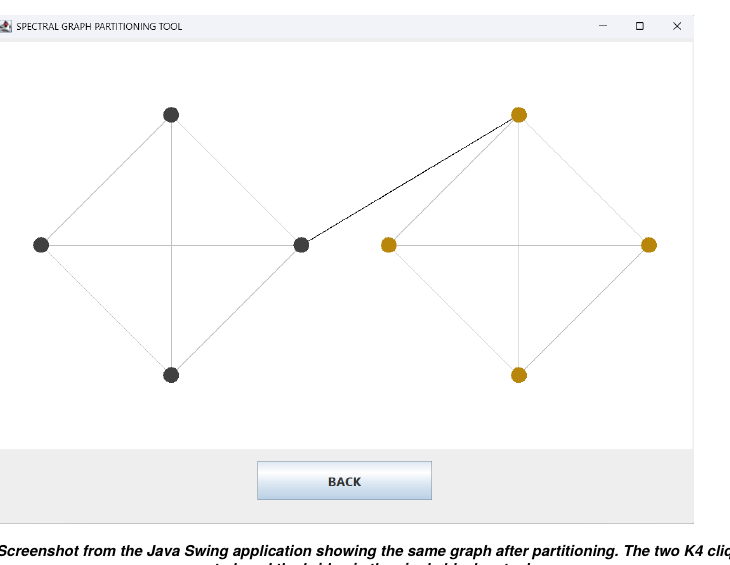
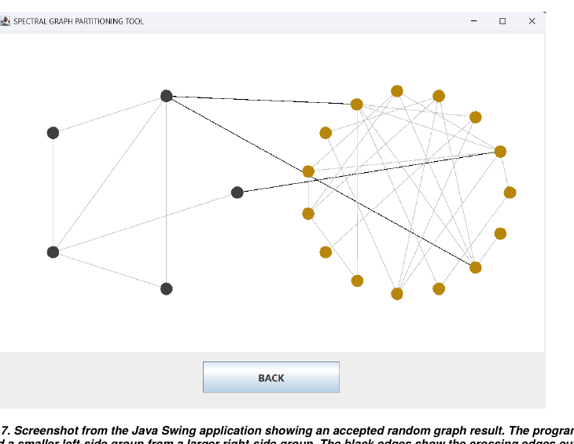
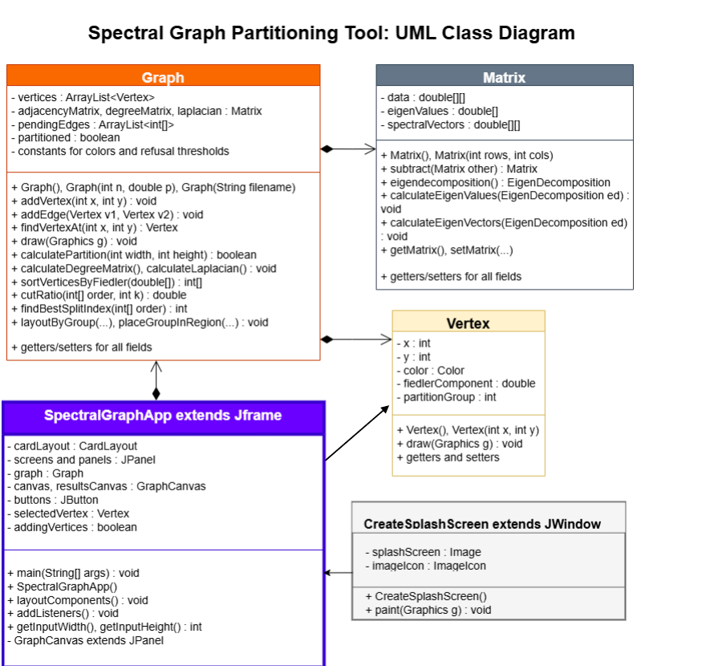

# Spectral Graph Partitioning Tool

A Java Swing application that partitions an undirected graph into two groups
using the **Fiedler vector** — the eigenvector of the graph Laplacian
associated with the second-smallest eigenvalue. The user can supply a graph by
loading an adjacency matrix from a text file, by generating a random graph, or
by drawing one directly on the canvas. After partitioning, the two resulting
groups are repositioned into separate regions of the results canvas with the
cut edges drawn in black.

**Author:** Ivan Zaluzhnyy
**Language:** Java (Swing GUI)
**Dependency:** Apache Commons Math 3.6.1 (for the eigendecomposition)

---

## Screenshots

### Welcome screen



### Sample graph: two K₄ cliques joined by one bridge

Before partitioning (input layout):



After partitioning. The two K₄ cliques are separated into the two groups
(dark gray and dark gold), and the bridge edge is the single black cut edge:



### Randomly generated graph (accepted partition)

A randomly generated graph where the program separated a smaller, sparser
group from a larger, denser group. Black edges are the cut edges between
the two groups:



---

## How it works

A graph with *n* vertices is stored as an *n × n* adjacency matrix **A**.
The degree matrix **D** is diagonal with row sums of **A** on the diagonal.
The graph Laplacian is defined as

> **L = D − A**

For an undirected graph, the smallest eigenvalue of **L** is zero. The
second-smallest eigenvalue — the **Fiedler value** (algebraic connectivity) —
and its associated eigenvector — the **Fiedler vector** — carry information
about how the graph is structurally connected:

- When the graph is **disconnected**, the Fiedler value drops to zero
  (or to a number numerically close to zero).
- When the graph has a **weak bottleneck**, the Fiedler value is small but
  nonzero, and the Fiedler vector separates the two sides near the bottleneck.
- When the graph is **densely connected** with no clear weak spot, the
  Fiedler value is larger.

The program uses these properties as follows:

1. **Build the Laplacian** from the user-supplied adjacency matrix.
2. **Eigendecompose** using Apache Commons Math.
3. **Reject the partition** if the Fiedler value is approximately zero
   (disconnected) or above an empirical threshold (too well-connected for a
   meaningful split). This is motivated by the Cheeger inequality.
4. **Order vertices** along the Fiedler vector by sorting them by their
   Fiedler-vector component (smallest to largest).
5. **Sweep over candidate splits.** Rather than splitting on the sign of the
   Fiedler component (which behaves poorly on lopsided graphs), the program
   evaluates every split point *k* along the sorted order and chooses the
   one that minimizes the cut ratio:

   > φ(S) = |E(S, S^c)| / min(|S|, |S^c|)

   The denominator penalizes one-sided cuts that simply isolate a tiny
   group. The cut-ratio sweep is adapted from Roch's
   [Mathematical Methods in Data Science, §5.5](https://mmids-textbook.github.io/chap05_specgraph/05_partitioning/roch-mmids-specgraph-partitioning.html).
6. **Reject the partition** if even the best available cut has a cut ratio
   above an empirical threshold (no clean bottleneck exists).
7. **Reposition vertices** so group 0 occupies the left half of the results
   canvas and group 1 the right half. Within each half, vertices are placed
   around a circle using a simplified version of JGraphT's
   [`CircularLayoutAlgorithm2D`](https://jgrapht.org/javadoc/org.jgrapht.core/org/jgrapht/alg/drawing/CircularLayoutAlgorithm2D.html).
   Cut edges become the only edges crossing the canvas midline and are
   highlighted in black.

For the full mathematical background, design decisions, and a more detailed
algorithm walkthrough, see
[`docs/Spectral_Graph_Partitioning_Writeup.pdf`](docs/Spectral_Graph_Partitioning_Writeup.pdf).

---

## Class design

The application is organized into five classes.



- **`SpectralGraphApp`** — the main GUI class. Extends `JFrame` and owns the
  welcome / input / results screens, buttons, canvases, and event listeners.
  Pure input/output shell: when the user clicks something, it calls the right
  method on the current `Graph`.
- **`Graph`** — the central model class. Holds the list of `Vertex` objects,
  the adjacency / degree / Laplacian matrices, and runs the partitioning
  algorithm in `calculatePartition()`. Also handles drawing (gray edges
  before partition, black cut edges and light-gray within-group edges
  after partition).
- **`Matrix`** — wraps a `double[][]` and delegates the eigendecomposition to
  Apache Commons Math, then stores the eigenvalues and Fiedler vector for use
  by `Graph`.
- **`Vertex`** — stores `(x, y)` coordinates, color, Fiedler component, and
  partition group for a single vertex, with its own `draw()` method.
- **`CreateSplashScreen`** — startup `JWindow` showing a logo for a few
  seconds before launching `SpectralGraphApp`.

---

## Build and run

### Requirements

- Java 8 or newer (`javac` and `java` on your `PATH`)
- Apache Commons Math 3.6.1 (`commons-math3-3.6.1.jar`) — **included** at the project root for convenience. Distributed under the Apache License 2.0; original source: [Apache Commons Math archives](https://archive.apache.org/dist/commons/math/binaries/).

### Compile

From the project root:

```bash
javac -cp "commons-math3-3.6.1.jar" src/*.java -d out
```

(Or, if you prefer compiling in place: `cd src && javac -cp "../commons-math3-3.6.1.jar" *.java`. In that case, run with `java -cp "src;commons-math3-3.6.1.jar" SpectralGraphApp` from the project root so `Sample Graph.txt` and `logo.png` resolve correctly.)

### Run

**Windows:**

```bash
java -cp "out;commons-math3-3.6.1.jar" SpectralGraphApp
```

**macOS / Linux:**

```bash
java -cp "out:commons-math3-3.6.1.jar" SpectralGraphApp
```

The classpath separator is `;` on Windows and `:` on macOS/Linux.

Note: fonts are tuned for Windows. The Swing layout still works on macOS and
Linux but some labels may render at slightly different sizes.

---

## Try it out

### Hand-drawn example: two triangles joined by one bridge

1. Click **DRAW** on the welcome screen.
2. Click three points on the left side of the canvas and three on the right
   to place six vertices.
3. Click **DONE ADDING VERTICES**.
4. In edge mode, click pairs of vertices on the left to make a triangle,
   then pairs on the right to make another triangle, then connect one
   vertex on the left to one vertex on the right (the bridge edge).
5. Click **PARTITION**.

The program should place the two triangles in different groups and draw the
bridge edge as a single black cut edge.

### Provided sample graph: two K₄ cliques joined by one bridge

Click **LOAD FROM FILE** and enter `Sample Graph.txt`. The included
adjacency matrix is two complete K₄ graphs joined by a single bridge edge,
which produces the partition shown in the screenshots above.

### Random graph

Click **GENERATE RANDOM** and try *n ≈ 10–15* with *p ≈ 0.15*. Random
graphs are not guaranteed to partition cleanly: some are disconnected (too
low *p*), some are too dense (too high *p*), and some have no clear
bottleneck. The program will refuse to partition in those cases and explain
why — that behavior is intentional.

---

## Limitations

- **Bipartitioning only.** The algorithm produces a single two-way split.
  A k-way clustering tool would require recursively partitioning each side.
- **Empirical thresholds.** The dense-graph threshold (on the Fiedler value)
  and the cut-ratio refusal threshold were tuned by hand on small graphs.
- **Display layout is not spectral embedding.** Group regions use a circular
  layout, not the true 2D Fiedler / 3rd-eigenvector embedding.

See the writeup for further discussion of design tradeoffs and future work.

---

## References

- Fiedler, M. *Algebraic connectivity of graphs.* Czechoslovak Mathematical
  Journal, 23(2): 298–305, 1973.
- Roch, S. *Mathematical Methods in Data Science (with Python)*, Chapter 5,
  Section 5.5: Application — graph partitioning via spectral clustering.
  <https://mmids-textbook.github.io/chap05_specgraph/05_partitioning/roch-mmids-specgraph-partitioning.html>
- von Luxburg, U. *A tutorial on spectral clustering.* Statistics and
  Computing, 17(4): 395–416, 2007. <https://arxiv.org/abs/0711.0189>
- The Apache Software Foundation. *Apache Commons Math, version 3.6.1.*
  <https://commons.apache.org/proper/commons-math/>
- JGraphT. *CircularLayoutAlgorithm2D.*
  <https://jgrapht.org/javadoc/org.jgrapht.core/org/jgrapht/alg/drawing/CircularLayoutAlgorithm2D.html>

The cut-ratio sweep is adapted from Roch's Python `cut_ratio` and
`spectral_cut2` helpers, with the algorithm rewritten in Java. The
circular layout routine is a simplified port of JGraphT's
`CircularLayoutAlgorithm2D`. The splash-screen `JWindow` skeleton is
adapted from a [Tutorialspoint example](https://www.tutorialspoint.com/how-can-we-implement-a-splash-screen-using-jwindow-in-java).
Source attributions are also in the relevant method-level Javadoc.

---

## License

This project's source code is released under the MIT License. See [`LICENSE`](LICENSE) for
details.

The bundled `commons-math3-3.6.1.jar` is from the Apache Commons Math project and is distributed
under the [Apache License 2.0](https://www.apache.org/licenses/LICENSE-2.0). It is included here
unmodified for convenience; the original artifact and license are available at the
[Apache Commons Math archives](https://archive.apache.org/dist/commons/math/binaries/).
